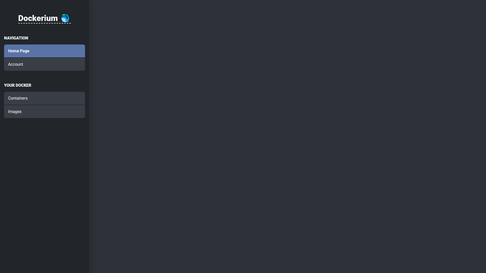

# Dockerium 🐳

### About

**Dockerium** is an open source project that you'll host in your VPS or Bare Metal, **Dockerium** will manage projects that are _Docker Images_ that you upload to your _Docker Registry_

### Instalation steps

Let's start by installing Docker:

```cmd
curl -s https://get.docker.com/ | sudo sh
```

Now, let's remove the need for a root user:

```cmd
curl -s https://get.docker.com/rootless | sudo sh
```

... more installation steps to come...

### Development progress history

> 2022-12-31
> 
